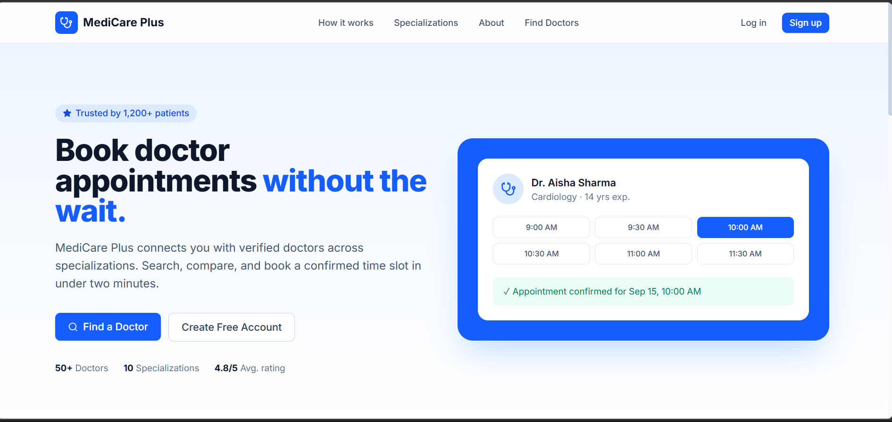
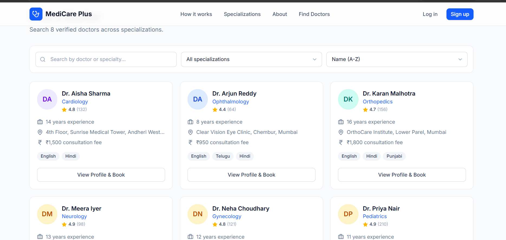
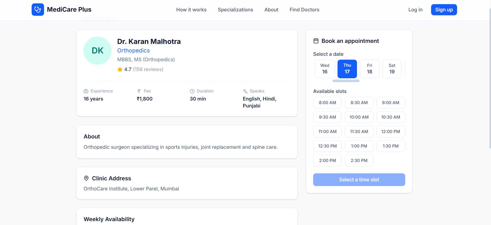
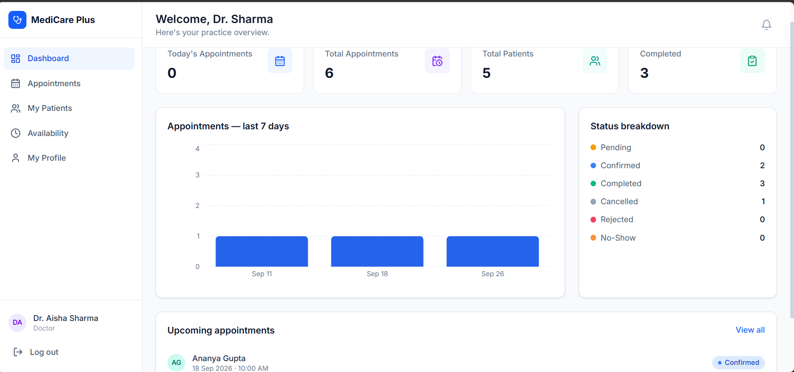
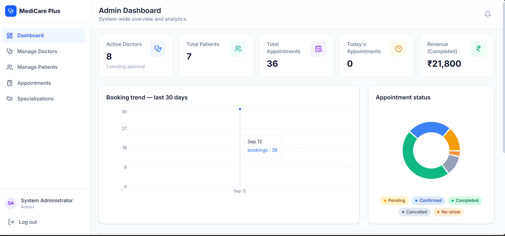

# MediCare Plus — Doctor Appointment Management System

A full-stack, production-style healthcare appointment booking platform built with the **MERN stack** (MongoDB, Express, React, Node.js). Patients search for doctors and book real, conflict-free time slots; doctors manage their schedule and patients; admins run the whole platform with analytics.

> Built as a portfolio project to demonstrate full-stack engineering: authentication & authorization, relational data modeling in MongoDB, a real scheduling/concurrency problem (no double-booking), role-based dashboards, and a polished, responsive UI.

---

## Table of Contents

1. [Features](#features)
2. [Tech Stack](#tech-stack)
3. [Architecture](#architecture)
4. [Folder Structure](#folder-structure)
5. [Getting Started](#getting-started)
6. [Environment Variables](#environment-variables)
7. [Demo Credentials](#demo-credentials)
8. [Database Design](#database-design)
9. [API Overview](#api-overview)
10. [Security](#security)
11. [Screenshots](#screenshots)
12. [Future Improvements](#future-improvements)

---

## Features

### 👤 Patient
- Register / log in with a dedicated JWT session
- Search & filter doctors by name, specialization, fee range and experience
- View a doctor's full profile, weekly availability and real-time open slots
- Book an appointment — the backend validates the slot server-side (no trusting the client)
- Reschedule or cancel upcoming appointments
- View upcoming/past appointment history
- Manage personal + medical profile (blood group, allergies, emergency contact, etc.)

### 🩺 Doctor
- Dashboard with live stats: today's appointments, total patients, 7-day booking trend, status breakdown chart
- View & manage appointments: confirm, reject, mark completed (with consultation notes), mark no-show
- Filter appointments by status/date
- View the list of patients who've booked with them
- Configure weekly working hours per day + appointment slot duration
- Manage professional profile (bio, fee, qualifications, clinic address, languages)

### 🛡️ Admin
- System-wide analytics dashboard: booking trend (30 days), status pie chart, top specializations, revenue
- Manage doctors: create accounts, approve/reject signups, activate/deactivate, delete
- Manage patients: search, activate/deactivate accounts
- View & cancel any appointment platform-wide, with filters (status, date range)
- Full CRUD on medical specializations

### Cross-cutting
- Real-time slot generation from doctor working hours + duration, minus already-booked slots
- **Double-booking is structurally impossible**: a partial unique MongoDB index on `{doctor, date, startTime}` (scoped to active statuses) guarantees it at the database layer, not just in application logic
- Toast notifications, confirmation dialogs, skeleton loaders, empty/error states, pagination, and accessible forms throughout
- Fully responsive: sidebar collapses to a mobile drawer, tables scroll horizontally, forms stack on small screens

---

## Tech Stack

| Layer | Technology |
|---|---|
| Frontend | React 18, Vite, React Router v6, Tailwind CSS v4 |
| Charts | Recharts |
| Icons | lucide-react |
| Notifications | react-hot-toast |
| Backend | Node.js, Express |
| Database | MongoDB + Mongoose |
| Auth | JWT + bcrypt |
| Validation | express-validator (server), custom form validation (client) |
| Security middleware | Helmet, CORS, express-rate-limit, express-mongo-sanitize |

---

## Architecture

```
┌─────────────────┐        HTTPS/JSON         ┌──────────────────┐        Mongoose        ┌─────────────┐
│  React (Vite)    │ ───────────────────────▶ │  Express REST API │ ─────────────────────▶ │  MongoDB     │
│  - Pages/Routes   │ ◀─────────────────────── │  - Controllers    │ ◀───────────────────── │  Collections │
│  - Auth Context   │      JWT in headers       │  - Middleware     │                        └─────────────┘
│  - Axios services │                            │  - Models         │
└─────────────────┘                            └──────────────────┘
```

- **Frontend and backend are fully decoupled** — separate `package.json`, separate deploy targets. The frontend talks to the API purely over HTTP with a JWT bearer token.
- **Role-based routing**: `ProtectedRoute` on the client checks `role` before rendering a dashboard; every sensitive backend route re-checks the role server-side via the `authorize()` middleware — the frontend guard is a UX convenience, never the source of truth.
- **Slot generation & booking** is the core domain logic: `backend/src/utils/slotGenerator.js` computes candidate slots from a doctor's working hours and appointment duration; `appointmentController.js` re-validates the chosen slot against working hours and existing bookings at write time, and a MongoDB partial unique index is the final backstop against race conditions (e.g. two patients booking the same slot within milliseconds of each other).

---

## Folder Structure

```
dr-appointment-system/
├── backend/
│   ├── server.js                 # entry point
│   ├── .env.example
│   └── src/
│       ├── app.js                # Express app: middleware + route mounting
│       ├── config/db.js          # Mongoose connection
│       ├── models/                # User, Patient, Doctor, Appointment, Specialization
│       ├── controllers/           # business logic per resource
│       ├── routes/                # Express routers
│       ├── middleware/            # auth, roleCheck, validate, errorHandler, rateLimiter
│       ├── utils/                 # generateToken, slotGenerator, apiError
│       └── seed/seed.js           # demo data seeder
│
└── frontend/
    ├── .env.example
    └── src/
        ├── api/                   # axios instance + one service module per resource
        ├── context/AuthContext.jsx
        ├── hooks/                 # useDebounce, useFetch
        ├── routes/ProtectedRoute.jsx
        ├── components/
        │   ├── common/            # Button, Input, Modal, Table, Badge, Pagination, ...
        │   ├── layout/             # Sidebar, DashboardLayout, PublicNavbar, Footer
        │   ├── patient/ doctor/ admin/   # role-specific composed components
        ├── pages/
        │   ├── public/  auth/  patient/  doctor/  admin/
        └── utils/                 # formatters, constants
```

---

## Getting Started

### Prerequisites
- Node.js 18+
- MongoDB running locally, or a free [MongoDB Atlas](https://www.mongodb.com/cloud/atlas) cluster

### 1. Clone & install

```bash
git clone <your-repo-url>
cd dr-appointment-system

# Backend
cd backend
npm install
cp .env.example .env
# edit .env with your MONGO_URI and a strong JWT_SECRET

# Frontend
cd ../frontend
npm install
cp .env.example .env
```

### 2. Seed the database with demo data

```bash
cd backend
npm run seed
```

This creates 10 specializations, 9 doctors (8 approved + 1 pending, to demo the approval workflow), 6 patients, ~40 realistic appointments across every status, and 1 admin account. See [Demo Credentials](#demo-credentials).

To wipe the demo data without reseeding: `npm run seed:destroy`.

### 3. Run both servers

```bash
# Terminal 1 — backend (http://localhost:5000)
cd backend
npm run dev

# Terminal 2 — frontend (http://localhost:5173)
cd frontend
npm run dev
```

The Vite dev server proxies `/api/*` to `http://localhost:5000` (see `vite.config.js`), so the frontend works out of the box against a local backend with no extra CORS setup.

### 4. Build for production

```bash
cd frontend && npm run build   # outputs to frontend/dist
cd backend && npm start        # NODE_ENV=production node server.js
```

---

## Environment Variables

**backend/.env**

| Variable | Description |
|---|---|
| `NODE_ENV` | `development` or `production` |
| `PORT` | API port (default `5000`) |
| `MONGO_URI` | MongoDB connection string |
| `JWT_SECRET` | Long random secret used to sign JWTs — **never commit a real one** |
| `JWT_EXPIRES_IN` | Token lifetime, e.g. `7d` |
| `CLIENT_URL` | Comma-separated allowed CORS origins, e.g. `http://localhost:5173` |

**frontend/.env**

| Variable | Description |
|---|---|
| `VITE_API_URL` | Base URL of the API, e.g. `http://localhost:5000/api` |

Neither `.env` file is committed — only the `.env.example` templates are, per `.gitignore`.

---

## Demo Credentials

All seeded accounts use the password **`Password123`**.

| Role | Email |
|---|---|
| Admin | `admin@medicare.demo` |
| Doctor (Cardiology) | `aisha.sharma@medicare.demo` |
| Doctor (pending approval, for admin demo) | `farah.khan@medicare.demo` |
| Patient | `rahul.deshmukh@example.demo` |

The login page also has one-click buttons to autofill these for a quick demo.

---

## Database Design

Five core collections, connected by ObjectId references:

```
User (base auth account: name, email, password[hashed], phone, role, isActive)
 │
 ├── 1:1 ──▶ Patient (dateOfBirth, gender, bloodGroup, address, allergies, ...)
 └── 1:1 ──▶ Doctor  (specialization, qualifications, fee, workingHours[], ...)
                │
Specialization ─┘ (referenced by Doctor and denormalized onto Appointment for fast filtering)

Appointment
 ├── patient        → Patient
 ├── doctor          → Doctor
 ├── specialization  → Specialization (denormalized for admin analytics queries)
 ├── date, startTime, endTime, status, reasonForVisit, doctorNotes, ...
```

**Key design decisions:**
- `User` is a single base table for all three roles rather than three separate login systems — keeps auth logic (hashing, JWT, password reset) in one place, with `Patient`/`Doctor` holding only role-specific fields.
- **Double-booking prevention**: `Appointment` has a partial unique index on `{ doctor: 1, date: 1, startTime: 1 }`, scoped to `status: { $in: ['pending', 'confirmed', 'completed'] }`. A cancelled/rejected appointment doesn't block the slot from being rebooked, but two *active* appointments can never occupy the same doctor/date/time — enforced by MongoDB itself, immune to application-level race conditions.
- Indexes on `{doctor, date}`, `{patient, date}`, and `{status}` support the dashboard queries and list filters without full collection scans.

---

## API Overview

Base URL: `/api`. All protected routes require `Authorization: Bearer <token>`.

| Method | Endpoint | Access | Description |
|---|---|---|---|
| POST | `/auth/register` | Public | Register a patient account |
| POST | `/auth/login` | Public | Log in (any role) |
| GET | `/auth/me` | Private | Get current user + role profile |
| PUT | `/auth/me` | Private | Update name/phone/avatar |
| PUT | `/auth/change-password` | Private | Change password |
| GET | `/doctors` | Public | Search doctors (filters, pagination) |
| GET | `/doctors/:id` | Public | Doctor public profile |
| GET | `/doctors/:id/availability?date=` | Public | Real-time open slots for a date |
| GET/PUT | `/doctors/me` | Private/Doctor | Doctor's own profile |
| PUT | `/doctors/me/working-hours` | Private/Doctor | Update weekly schedule |
| GET | `/doctors/me/dashboard-stats` | Private/Doctor | Doctor dashboard analytics |
| GET | `/doctors/me/patients` | Private/Doctor | Doctor's patient list |
| POST | `/doctors` | Private/Admin | Create a doctor account |
| GET | `/doctors/admin/all` | Private/Admin | List/search all doctors |
| PUT | `/doctors/:id/status` | Private/Admin | Approve/reject/activate/deactivate |
| DELETE | `/doctors/:id` | Private/Admin | Delete a doctor |
| GET/PUT | `/patients/me` | Private/Patient | Patient's own profile |
| GET | `/patients/me/dashboard-stats` | Private/Patient | Patient dashboard analytics |
| GET | `/patients/admin/all` | Private/Admin | List/search all patients |
| PUT | `/patients/:id/status` | Private/Admin | Activate/deactivate a patient |
| POST | `/appointments` | Private/Patient | Book an appointment |
| GET | `/appointments/:id` | Private (owner/admin) | Get one appointment |
| PUT | `/appointments/:id/cancel` | Private | Cancel |
| PUT | `/appointments/:id/reschedule` | Private/Patient | Reschedule to a new slot |
| PUT | `/appointments/:id/confirm` | Private/Doctor | Confirm a pending request |
| PUT | `/appointments/:id/reject` | Private/Doctor | Reject a pending request |
| PUT | `/appointments/:id/complete` | Private/Doctor | Mark completed + add notes |
| PUT | `/appointments/:id/no-show` | Private/Doctor | Mark as no-show |
| GET | `/appointments/patient/me` | Private/Patient | Patient's appointments (upcoming/past) |
| GET | `/appointments/doctor/me` | Private/Doctor | Doctor's appointments (filterable) |
| GET | `/appointments/admin/all` | Private/Admin | All appointments (rich filters) |
| GET/POST | `/specializations` | Public / Admin | List / create |
| PUT/DELETE | `/specializations/:id` | Private/Admin | Update / delete |
| GET | `/admin/dashboard-stats` | Private/Admin | System-wide analytics |

Every list endpoint supports `page` and `limit` query params and returns `{ success, count, total, page, pages, data }`. Errors always return `{ success: false, message, errors?: [] }`.

---

## Security

- Passwords hashed with **bcrypt** (12 salt rounds), never returned in API responses (`toJSON` strips the hash)
- **JWT** bearer auth; tokens are invalidated implicitly if the password changes after issuance
- **Role-based authorization** middleware (`authorize('admin')`, etc.) on every sensitive route — checked server-side regardless of what the frontend shows
- **express-validator** on all mutating routes (registration, booking, doctor creation, etc.)
- **Helmet** for secure HTTP headers, **CORS** restricted to configured origins, **express-rate-limit** (tighter on `/auth/*`), **express-mongo-sanitize** to block NoSQL injection via `$`/`.` operators in input
- Centralized error handler normalizes Mongoose validation errors, duplicate-key errors (e.g. double-booking races) and invalid ObjectIds into consistent, non-leaky responses
- Secrets are never committed — `.env` is git-ignored on both ends; only `.env.example` templates ship in the repo

---

## Screenshots

> Add screenshots to `docs/screenshots/` and reference them here — see `docs/screenshots/README.md` for the suggested list and naming.

| | |
|---|---|
| Landing page |  |
| Doctor search |  |
| Booking flow |  |
| Doctor dashboard |  |
| Admin analytics |  |

---

## Future Improvements

- Email/SMS notifications on booking, confirmation, cancellation and reminders (e.g. via Nodemailer + a queue)
- In-app real-time updates via WebSockets (e.g. doctor sees a new booking without refreshing)
- Payment integration for consultation fees (Stripe/Razorpay) with refund handling on cancellation
- Video consultation support for telemedicine appointments
- Patient-submitted reviews/ratings tied to completed appointments (currently `rating`/`totalReviews` are seed-only)
- Doctor document verification upload (license, ID) as part of the approval workflow
- Automated tests: Jest + Supertest for API contract tests, React Testing Library for critical UI flows
- Multi-day/exception scheduling (holidays, one-off time off) beyond the fixed weekly template
- Internationalization (i18n) and multi-timezone support for a non-single-timezone deployment

---

## License

This project is built for educational/portfolio purposes. Feel free to fork and adapt it.
